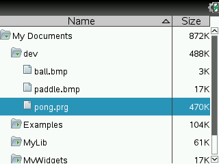

# nspire-nd-pong

pong built with [nspire-nd](https://github.com/0xFireball/nspire-nd), a 2d framework that runs on both desktop and `ndless` on the TI Nspire.

This is a low-framerate GIF screen recording from
the TI Nspire CX CAS.
(The game runs quite well on the Nspire, the GIF
here just has a low framerate)

## Build

Linux: `make DISTDIR=linux XPLAT_TARGET=desktop`

Nspire: `make DISTDIR=binspire XPLAT_TARGET=nspire`

Add `DEBUG=1` for debug symbols.

Copy assets:

Run `make assets DESTDIR=your_dest_dir `

## Hacking

Debugging on desktop should be relatively painless,
and VSCode launch config is set up to debug the desktop
binary with GDB.

When debugging the Nspire you will have to use remote GDB:
`arm-none-eabi-gdb -tui -ex "target remote :3333" -ex "c" -ex "bt" pong.elf`
